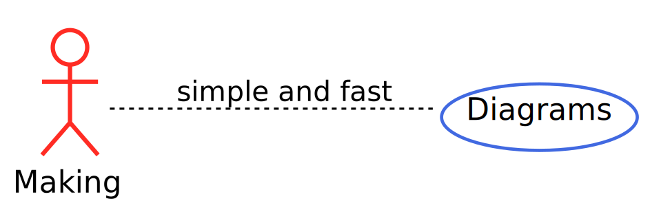
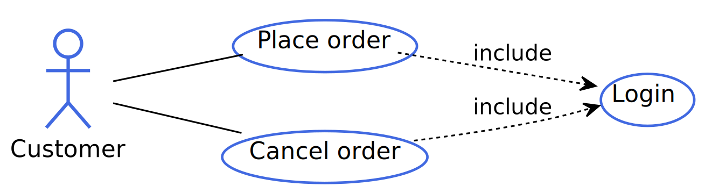
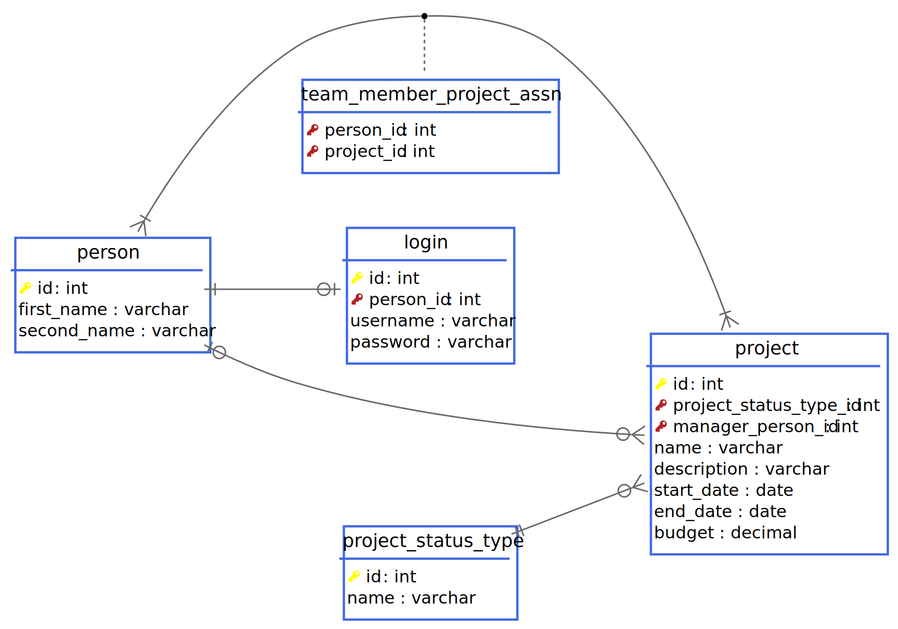

<p align="center">
    <a href="" rel="noopener">
        
    </a>
</p>

<h1 align="center">PlantUML Templates</h1>

<div align="center">

[](https://github.com/luisenricke/PlantUML-Template/issues)
[](https://github.com/luisenricke/PlantUML-Template/pulls)
[](/LICENSE)

</div>

<p align="center"> 🏷️ A simple functions for modeling with UML in PlantUML
    <br> 
</p>

## About <a name = "about"></a>
This project was made to generate UML diagrams without any interaction of the UI but still having control of what is being seen through simple functions that associate the concepts of UML.

At the moment there is only support for usage case diagrams and database models.

## Getting Started <a name = "getting_started"></a>
These instructions will provide you with a reference of the template to make the diagrams you want. The suggested file to use for the diagrams is the ``puml``.

### Prerequisites
You need to install these to run PlantUML:
- [Java](https://www.java.com/en/download/)
- [Graphviz](https://graphviz.org/download/)

If you use VSCode there is a [extension](https://github.com/qjebbs/vscode-plantuml) with a great plantuml support that helps to render the image in an easier way.

### Configuration
First of all, you must create a file containing the diagram and put the next code

```
@startuml <<DiagramName>>

@enduml
```

If you have installed the extension in VSCode with the ``alt+d`` shortcut, a preview of the image is activated.

If you want to use another text editor, you will have to download the [plantuml jar](http://plantuml.com/download) and run the below command.

```shell
java -jar path\to\plantuml.jar path\to\FileName.puml

# Example in different folders
java -jar C:\Users\ExampleUSer\Downloads\plantuml.jar C:\Work\UseCaseTest.puml

# Example in same folder
java -jar plantuml.jar UseCaseTest.puml
```

#### Option 1: Source Code
You need to download the source code from the project and make the reference of what you downloaded.

```shell
git clone git@github.com:luisenricke/PlantUML-Template.git
```

Adding the reserved word include and the template path can use all the functionalities of the templates.

```
@startuml <<DiagramName>>
!include path\to\TemplateUC.puml
!include path\to\TemplateDB.puml
@enduml
```

#### Option 2: URL Link
It is required to have internet as it will point directly to the url in which the file is hosted. Adding the reserved word includeurl and the template link can use all the functionalities of the templates

```
@startuml <<DiagramName>>
!includeurl https://raw.githubusercontent.com/luisenricke/PlantUML-Template/master/templates/TemplateUC.puml
!includeurl https://github.com/luisenricke/PlantUML-Template/blob/master/templates/TemplateDB.puml
@enduml
```

## Usage <a name="usage"></a>
<!--Example: https://theartfulmodellerdotcom.files.wordpress.com/2015/11/simple-use-cases.png -->
A simple example of the use case diagram

```
@startuml CustomerOrdering
!include path\to\TemplateUC.puml
actor("Customer", customer, "normal")
uc("Place order", uc1)
uc("Cancel order", uc2)
uc("Login", uc3)

association(customer, uc1, "--", false)
association(customer, uc2, "--", false)
include(uc1, uc3, "..", false, 1, false)
include(uc2, uc3, "..", false, 1, false)
@enduml
```



<!-- Example: http://examples.qcodo.com/examples/images/data_model.png-->
A simple example of the modeling database

```
@startuml CustomerOrdering
!include path\to\TemplateDB.puml
Table(person){
    primary_key(id) : int
    first_name : varchar
    second_name : varchar
}

Table(login){
    primary_key(id) : int
    foreign_key(person_id) : int
    username : varchar
    password : varchar
}

Table(project){
    primary_key(id) : int
    foreign_key(project_status_type_id) : int
    foreign_key(manager_person_id) : int
    name : varchar
    description : varchar
    start_date : date
    end_date : date
    budget : decimal
}

Table(project_status_type){
    primary_key(id) : int
    name :  varchar
}

Table(team_member_project_assn){
    foreign_key(person_id) : int
    foreign_key(project_id) : int
}

oneToOneZ(person, login, false, "--")
oneZToManyZ(person, project, false, "--")
manyZToOne(project, project_status_type, true, "--")
manyToMany(person, project, team_member_project_assn, false, "--", "..")
```



## Use Case Diagrams

- Definition of actor:
```
/'Type: normal | primary | secondary
actor($name, $variable, $type)
```

- Definition of use case:
```
uc($name, $variable)
```

- Association function:
```
/'line: The variable is filled by dashes(-), the more they are the longer the line will be.
/'swap: true | false
association($actorVariable, $ucVariable, $line, $swap)
```

- Generalization function:
```
/'line: The variable is filled by dashes(-), the more they are the longer the line will be.
/'swap: true | false
/'whosTheFather: 1 | 2
generalization($fatherVariable, $childVariable, $line, $swap, $whosTheFather)
```

- Include function:
```
/'line: The variable is filled by dots(.), the more they are the longer the line will be.
/'swap: true | false
/'whosTheFather: 1 | 2
/'needSpace: true | false
include($firstVariable, $secondVariable, $line, $swap, $whoStarts, $needSpace)
```

- Extend function:
```
/'line: The variable is filled by dots(.), the more they are the longer the line will be.
/'swap: true | false
/'whosTheFather: 1 | 2
/'needSpace: true | false
extend($firstVariable, $secondVariable, $line, $swap, $whoStarts, $needSpace)
```

## Database modeling

- Definition of table:
```
Table($name){
    /'fields
}
```

- Definition of primary key:
```
primary_key($variable)
```

- Definition of foreign key:
```
foreign_key($variable)
```

- Definition of unique key:
```
unique($variable)
```

- Definition of null field:
```
null($variable)
```

- Definition of foreign key and null key:
```
fk_n($variable)
```

- Function of relation "Zero or one to zero or one":
```
/'swap: true | false
/'line: The variable is filled by dashes(-), the more they are the longer the line will be.
oneZToOneZ($firstTable, $secondTable, $swap , $line)
```

- Function of relation "Zero or one to one":
```
/'swap: true | false
/'line: The variable is filled by dashes(-), the more they are the longer the line will be.
oneZToOne($firstTable, $secondTable, $swap , $line)
```

- Function of relation "Zero or one to zero or many":
```
/'swap: true | false
/'line: The variable is filled by dashes(-), the more they are the longer the line will be.
oneZToManyZ($firstTable, $secondTable, $swap , $line)
```

- Function of relation "Zero or one to many":
```
/'swap: true | false
/'line: The variable is filled by dashes(-), the more they are the longer the line will be.
oneZToMany($firstTable, $secondTable, $swap , $line)
```
<!-- -->

- Function of relation "one to zero or one":
```
/'swap: true | false
/'line: The variable is filled by dashes(-), the more they are the longer the line will be.
oneToOneZ($firstTable, $secondTable, $swap , $line)
```

- Function of relation "one to one":
```
/'swap: true | false
/'line: The variable is filled by dashes(-), the more they are the longer the line will be.
oneToOne($firstTable, $secondTable, $swap , $line)
```

- Function of relation "one to zero or many":
```
/'swap: true | false
/'line: The variable is filled by dashes(-), the more they are the longer the line will be.
oneToManyZ($firstTable, $secondTable, $swap , $line)
```

- Function of relation "one to many":
```
/'swap: true | false
/'line: The variable is filled by dashes(-), the more they are the longer the line will be.
oneToMany($firstTable, $secondTable, $swap , $line)
```

<!-- -------------------------- -->

- Function of relation "Zero or many to zero or one":
```
/'swap: true | false
/'line: The variable is filled by dashes(-), the more they are the longer the line will be.
manyZToOneZ($firstTable, $secondTable, $swap , $line)
```

- Function of relation "Zero or many to one":
```
/'swap: true | false
/'line: The variable is filled by dashes(-), the more they are the longer the line will be.
manyZToOne($firstTable, $secondTable, $swap , $line)
```

- Function of relation "Zero or many to zero or many":
```
/'swap: true | false
/'line: The variable is filled by dashes(-), the more they are the longer the line will be.
/'otherLine: The variable is filled by dots(.), the more they are the longer the line will be.
manyZToManyZ($firstTable, $secondTable, $thirdTable, $swap , $line, $otherLine)
```

- Function of relation "Zero or many to many":
```
/'swap: true | false
/'line: The variable is filled by dashes(-), the more they are the longer the line will be.
/'otherLine: The variable is filled by dots(.), the more they are the longer the line will be.
manyZToMany($firstTable, $secondTable, $thirdTable, $swap , $line, $otherLine)
```

<!-- -->

- Function of relation "many to zero or one":
```
/'swap: true | false
/'line: The variable is filled by dashes(-), the more they are the longer the line will be.
manyToOneZ($firstTable, $secondTable, $swap , $line)
```

- Function of relation "many to one":
```
/'swap: true | false
/'line: The variable is filled by dashes(-), the more they are the longer the line will be.
manyToOne($firstTable, $secondTable, $swap , $line)
```

- Function of relation "many to zero or many":
```
/'swap: true | false
/'line: The variable is filled by dashes(-), the more they are the longer the line will be.
/'otherLine: The variable is filled by dots(.), the more they are the longer the line will be.
manyToManyZ($firstTable, $secondTable, $thirdTable, $swap , $line, $otherLine)
```

- Function of relation "many to many":
```
/'swap: true | false
/'line: The variable is filled by dashes(-), the more they are the longer the line will be.
/'otherLine: The variable is filled by dots(.), the more they are the longer the line will be.
manyToMany($firstTable, $secondTable, $thirdTable, $swap , $line, $otherLine)
```

## Authors <a name = "authors"></a>

- 🤵 Luis Enrique Villalobos Meléndez | [Github](https://github.com/luisenricke/) |  [Twitter](https://twitter.com/LuisEnricKe)

## Acknowledgements <a name = "acknowledgement"></a>

- [PlantUML](http://plantuml.com/)
- [VS Code extension: PlantUML](https://github.com/qjebbs/vscode-plantuml)
- Inspired by [@QuantumGhost](https://gist.github.com/QuantumGhost/0955a45383a0b6c0bc24f9654b3cb561)